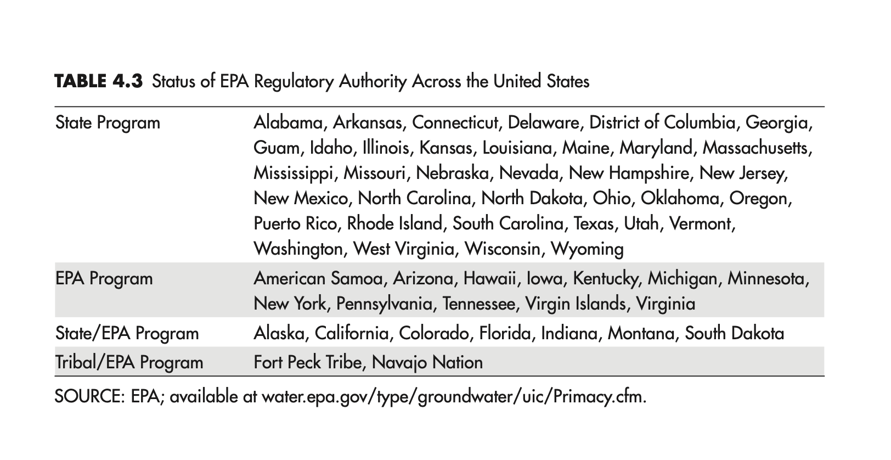

# Governmental Roles and Responsibilities Related to Underground Injection and Induced Seismicity

https://www.nap.edu/read/13355/chapter/7

"Four federal agencies—the EPA, the Bureau of Land Management (BLM), the U.S. Forest Service (USFS), and the U.S. Geological Survey (USGS)—and different state agencies have regulatory oversight, research roles, and/or responsibilities related to different parts of the underground injection activities that are associated with energy technologies. Understanding these roles and responsibilities is important to the future development of energy technologies in ways that preserve public safety while allowing development of energy resources. This chapter provides a brief description of each agency’s authority related to underground injection and induced seismicity. States’ roles and responsibilities are also discussed; however, the committee did not perform a comprehensive review of all the states that are active in addressing the issue."
"

